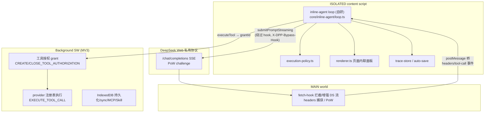

# Project Overview — pi-agent-core 集成

## Preliminary Direction

将开源 `@earendil-works/pi-agent-core@0.83.0`（MIT）内置为 DeepSeek++ inline agent 的 loop 引擎，通过自定义 StreamFn 把 DeepSeek 网页接口封装为模型后端，在 DS 聊天页面内联运行 Agent；替换现有自研 inline-agent loop（`core/inline-agent/loop.ts`），保留执行策略、授权路径与渲染层。目标：更强的 loop 能力（compaction/重试/并行工具）、降低自研维护、扩展工具生态、可复用 pi 的 agents/skills 配置。

## Current Architecture

**关键事实**：
- Inline agent 完全运行在 ISOLATED content 上下文；模型后端是 `core/deepseek/active-client.ts` 的 `submitPromptStreaming`（content 直连 DS Web API，用 MAIN world 捕获的 headers + 本地 PoW WASM 求解，绕过 hook）。
- 工具执行经 `chrome.runtime.sendMessage(EXECUTE_TOOL_CALL + authorizationId)` → background 授权（grant 绑定 capabilityScope/requestId/one-time reservation）后由 provider 执行。
- 当前自研 loop 限制：MAX_STEPS=25、MAX_NUDGES=8、STEP_TIMEOUT=120s、步间 2.5–6.5s 延迟、12k 流事件截断。

## Technology Stack

| Layer | Current | Target |
|:------|:--------|:-------|
| Language | TypeScript | TypeScript（不变） |
| Framework | WXT + React（sidepanel）+ vanilla content | 不变 |
| Agent loop | 自研 `core/inline-agent/loop.ts` | `@earendil-works/pi-agent-core@0.83.0`（精确锁版） |
| LLM provider | 自研 `active-client.submitPromptStreaming` | 自定义 StreamFn 薄适配器（复用 active-client） |
| Build | WXT/Vite（`build:all` 三浏览器） | 不变；需窄入口导入 + tree-shake 验证 |
| Tests | Vitest（197 个测试文件）+ golden fixtures | 不变；新增 loop 事件协议 golden |
| Persistence | IndexedDB（memory v30 等） | 不变（pi 上下文不落持久化） |

## Entry Points

- `entrypoints/background.ts` — background SW 组合根（授权、执行、持久化、MCP、自动化）
- `entrypoints/content.ts` — ISOLATED content（7793 行）：DOM 能力聚合、inline agent 宿主、`startInlineAgentLoop`
- `entrypoints/main-world.content.ts` — MAIN world：fetch-hook、headers/PoW、工具调用流式解析
- `entrypoints/sidepanel/*`、`floating-chat.content.ts`、`sandbox-offscreen/*`、`sandbox-runner/*`

## Build & Run

- 构建：`npm run build:all`（chrome/edge/firefox）；`zip:all` 出包
- 测试：`npm test`（vitest run，硬 60s 超时）
- 静态：`npm run compile`（tsc --noEmit）
- 验证链：`prompt:freeze` → `compile` → `test` → `verify:*` → `smoke:*` → `build:all` → `ci:quality`（21 段总闸门，CI 单 job 30min）
- 体积红线：background raw ≤ 820,000 / gzip ≤ 240,000；当前 633K/181K（余量 ≈187K/59K）；content.js 562K/159K（无独立红线，但影响页面加载）

## Testing Baseline

- 面：inline-agent（loop/prompt/policy/renderer）、tool-authorization（909 行）、deepseek stream/protocol/official-api、interceptor（fetch-hook/augmentation/tool-parser/history-cleanup）、compat fixtures（prompt-output golden ×4、external-runtime、persistence-contract ×10、runtime-contract）
- 关键机制：`prompt-output-contract.test.ts` 直接 import 生产函数校验 golden；授权测试用真实 provider 链（`tests/helpers/production-tool-runtime.ts`）
- **缺口**：AGENT_* loop 事件序列+载荷没有契约测试（只有行为测试）——替换 loop 前必须先补

## Project Governance Baseline

- 共享指令面：`AGENTS.md`（唯一项目级真源；root `CLAUDE.md` 禁止）
- 记忆面：Codex native memory；无 repo 内 memory 文件
- 兼容注册表：`docs/compatibility/README.md`（prompt-and-runtime / persistence-and-sync / platform-and-integrations），行结构 7 字段 + 变更协议 7 条
- 历史归档：`docs/archives/`（本次 run 之前已完成 mcp-capability-plane 归档，docs/ 命名空间空闲）

## External Integrations

- DeepSeek Web 私有协议（9 路由、SSE `{p,o,v}` patch、PoW、4MiB 预算）——唯一权威 `core/deepseek/stream-codec.ts`
- DeepSeek Official API（OpenAI 兼容 + reasoning_content）
- MCP（HTTP/SSE/Streamable）、Native Host（shell）、browser control（CDP）、sandbox（offscreen + Pyodide）
- 目标新增：`@earendil-works/pi-agent-core@0.83.0` + `@earendil-works/pi-ai@^0.83.0`（仅窄入口，避免拖入 AWS/Anthropic 等 SDK 依赖树）
