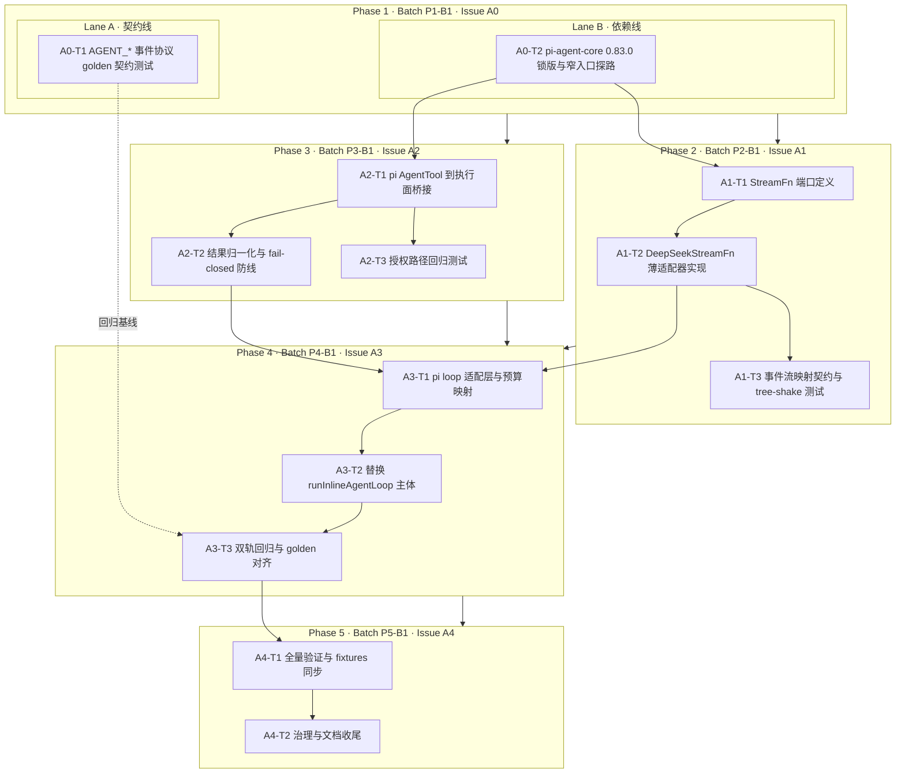

# Task Dependency Graph — pi-agent-core 集成 Step A

```mermaid
graph TD
    subgraph P1["Phase 1 · Batch P1-B1 · Issue A0"]
        subgraph P1A["Lane A · 契约线"]
            A0T1["A0-T1 AGENT_* 事件协议 golden 契约测试"]
        end
        subgraph P1B["Lane B · 依赖线"]
            A0T2["A0-T2 pi-agent-core 0.83.0 锁版与窄入口探路"]
        end
    end
    subgraph P2["Phase 2 · Batch P2-B1 · Issue A1"]
        A1T1["A1-T1 StreamFn 端口定义"]
        A1T2["A1-T2 DeepSeekStreamFn 薄适配器实现"]
        A1T3["A1-T3 事件流映射契约与 tree-shake 测试"]
    end
    subgraph P3["Phase 3 · Batch P3-B1 · Issue A2"]
        A2T1["A2-T1 pi AgentTool 到执行面桥接"]
        A2T2["A2-T2 结果归一化与 fail-closed 防线"]
        A2T3["A2-T3 授权路径回归测试"]
    end
    subgraph P4["Phase 4 · Batch P4-B1 · Issue A3"]
        A3T1["A3-T1 pi loop 适配层与预算映射"]
        A3T2["A3-T2 替换 runInlineAgentLoop 主体"]
        A3T3["A3-T3 双轨回归与 golden 对齐"]
    end
    subgraph P5["Phase 5 · Batch P5-B1 · Issue A4"]
        A4T1["A4-T1 全量验证与 fixtures 同步"]
        A4T2["A4-T2 治理与文档收尾"]
    end

    A0T1 -.->|回归基线| A3T3
    A0T2 --> A1T1
    A0T2 --> A2T1
    A1T1 --> A1T2 --> A1T3
    A1T2 --> A3T1
    A2T1 --> A2T2
    A2T1 --> A2T3
    A2T2 --> A3T1
    A3T1 --> A3T2 --> A3T3
    A3T3 --> A4T1 --> A4T2

    P1 --> P2
    P1 --> P3
    P2 --> P4
    P3 --> P4
    P4 --> P5
```

说明：
- A0-T1 与 A0-T2 无实线依赖（并行 lanes）；虚线为"基线/验证"关系（golden 是 A3-T3 的对照基准）。
- 子图即批次边界；批次间实线 = PR 合并顺序（前批合入才开下一批）。
- A3 内部严格顺序（loop.ts 单文件替换，禁并行）。
